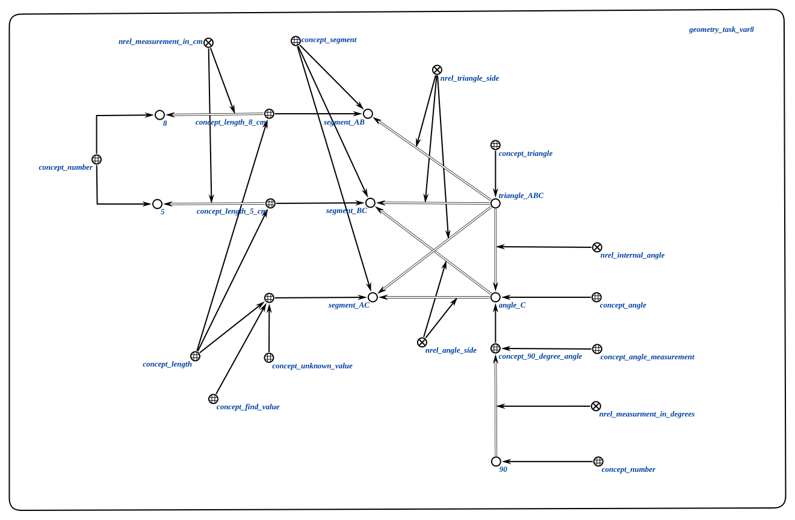

# Агент для определения значения для нахождения
Этот агент отвечает за определение неизвестного значения, которое нужно найти в задаче. В данном случае это длина катета AC в прямоугольном треугольнике ABC с прямым углом C, известными гипотенузой AB и другим катетом BC.

**Класс действий:**

`action_find_value_to_find`

**Параметры:**
1. `input_structure` - изначально пустая структура данных, которая будет впоследствии заполнена агентом;

**Ход работы агента:**
* Сначала генерируется необходимая конструкция для вызова агента интерпретации неатомарных действий. Пример этой конструкции показан ниже.

* Агент интерпретации вызывает сначала агента для генерации выражения для нахождения значения, который получает данные на основе известных значений;
вычисления значения, который отвечает за вычисление значения на основе сгенерированного математического выражения и известных значений.

### Пример

Пример входной структуры после получения выражения из имеющихся данных:

Пример логического правила:

### Результат

Возможные результаты:

* `SC_RESULT_OK` - гент успешно определил значение;
* `SC_RESULT_ERROR`- не удалось определить значение.
