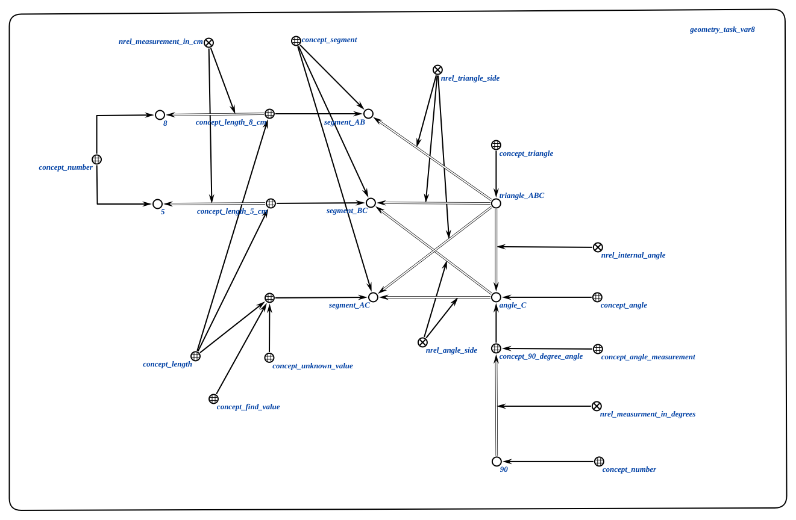

# Агент для генерации выражения для нахождения значения
Этот агент отвечает за генерацию математического выражения для нахождения неизвестного значения на основе известных значений.

**Класс действий:**

`action_generate_values_expression`

**Параметры:**
1. `input_structure` - изначально пустая структура данных, которая будет впоследствии заполнена агентом;

**Ход работы агента:**
* Агент получает заполненную input_structure от предыдущего агента;
* На основе известных значений и определения задачи (прямоугольный треугольник) генерируется выражение для нахождения неизвестного значения.
* В данном случае используется теорема Пифагора: $$ AC = \sqrt{AB^2 - BC^2} $$.

### Пример

Пример заполненной `input_structure`:

### Результат

Возможные результаты:

* `SC_RESULT_OK` - агент успешно сгенерировал выражение для нахождения значения;
* `SC_RESULT_ERROR`- не удалось сгенерировать выражение для нахождения значения.
